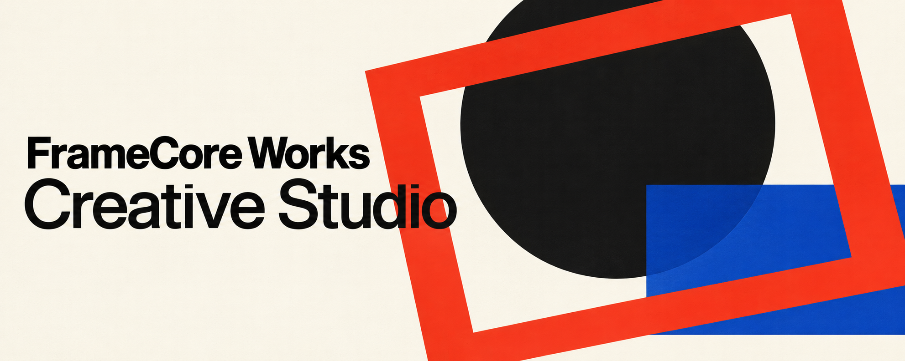

# FrameCore Works Creative Studio



Source version: **1.13.0**. [Repository](https://github.com/FrameCoreWorks/framecore-works-creative-studio) · [Installation](INSTALL.md) · [Release status](RELEASE_STATUS.md).

The five conditional quality improvements and bounded offline GEPA pilot are described in [Quality development 1.3.0](docs/quality-development-1.3.0.md). They preserve existing owners, UI and one review budget; no automatic prompt adoption or paid execution is introduced.

Creative Studio supports creative direction and production planning across image, video, audio and text. Brand-identity work connects strategy, logo/visual-system design and scoped logo/identity guides through existing owners, with revision-aware handoffs and explicit acceptance/file status. Work can begin with a brief, a product photo, a character reference, an existing clip, a script or a concrete correction.

## Learning or creation

Startup restores the complete Studio introduction and capability overview, then offers **1. Creative mode / 2. Learning mode** in the user's automatically selected language. A creative-only choice leads to **1. Quick mode / 2. Expanded mode**, then the established work-area menu and a relevant brief. The existing localized creation alias remains supported. Motion graphics remains in work area 8, reached through Creative Mode and Expanded Mode, with its HTML/SVG, GSAP, HyperFrames and Remotion descriptions and preview/export availability limits. A concrete request bypasses redundant menus, and numeric answers follow the last menu actually shown. Learning retains its personal plan, lessons, exercises, feedback and portable progress card. See [entry menus](plugins/framecore-work-creative-studio/skills/workflow-orchestrator/references/startup-and-creative-menus.md) and [learning mode and limits](plugins/framecore-work-creative-studio/docs/learning-mode.md).

## What it includes

- Quick mode: concise creative directions before detailed production work.
- Deep mode: collaborative development from research and concept through references, storyboard, prompts and editing plans.
- Product and character continuity, realistic reference capture and precise reference sheets.
- Static Graphic Design Creator methods for composition, typography, exact copy and graphic design.
- Music, voice and sound planning in relation to pictures, or picture planning around existing audio.
- Asset records, revisions, scoped preferences and portable handoffs between environments.
- Consistent skill display names, with a [standard for future additions](plugins/framecore-work-creative-studio/docs/skill-naming.md).
- 37 canonical skill entrypoints: 35 specialist routes, the orchestrator and a retained audio compatibility alias.

The package supplies instructions, knowledge, templates and local verification helpers. Generation, media inspection and editing require the user's available tools and authorization. No credentials, paid-provider account, persistent memory service or automatic cross-environment synchronization is bundled.

## Teacher Studio

Create original lesson scenarios, worksheets, games, quizzes, slide content, classroom guidance, career-exploration activities and teacher documents through existing owners. The profile includes a twelve-activity bank, three complete Polish teaching examples with keys and adaptations, and reusable pack/administration templates. It aligns objectives, student work and feedback while separating factual evidence, synthetic examples and unverified curriculum claims.

Creating school materials uses creation mode; learning how to create them remains optional Learning Mode. Actual documents, slides and graphics depend on available tools and require their own output checks. The examples are not classroom-tested or curriculum-certified. See [the teacher workflow](plugins/framecore-work-creative-studio/skills/workflow-orchestrator/references/teacher-workflow.md).

## Ad evidence and creative feedback

For social-ad work, choose a persuasive structure from supported proof, record observed competitor mechanisms separately from performance guesses, and connect supplied campaign results to the next bounded brief. An optional experiment card binds baseline/variant asset revisions, fixed conditions and actual evidence. These methods use existing owners and do not access ad accounts, publish campaigns or spend budget.

See [the ad analysis method](plugins/framecore-work-creative-studio/skills/ecommerce-campaign-strategy-director/references/ad-creative-analysis.md) and [the attributed adaptation](plugins/framecore-work-creative-studio/integrations/meta-ads-designer/README.md).

## Code-based motion graphics

The optional [motion toolkit](plugins/framecore-work-creative-studio/skills/hyperframes-workflow/references/motion-toolkit-routing.md) adds Three.js/R3F through Remotion, PixiJS effects, D3 data geometry, Mediabunny Canvas export, Lottie JSON playback and an existing-local-Manim clip bridge. Original examples include exact dependency pins and lockfiles, frame-seeking checks and explicit host/export boundaries. Install dependencies only inside an authorized project copy.

Use the existing HyperFrames/HTML/SVG or Remotion path for an approved storyboard, frame-driven implementation, actual-output review and delivery. The workflow includes a versioned motion/Style Lock contract, three stage prompts, source-bound asset/copy locks, a dependency-free synthetic frame starter and separate preview, temporal/audio and encoded-export evidence. Local execution depends on the available host tools.

[Motion craft](plugins/framecore-work-creative-studio/skills/hyperframes-workflow/references/motion-craft.md) gives concrete easing presets, frame durations, staggers, reading holds, beat grids and transition choices. Two runtime starters, a [Remotion kinetic type starter](plugins/framecore-work-creative-studio/skills/remotion-video-production/assets/kinetic-type-starter/README.md) and a [GSAP motion starter](plugins/framecore-work-creative-studio/skills/hyperframes-workflow/assets/gsap-motion-starter/README.md), read the same motion-score contract. Without a shell or renderer, a self-contained [single-file preview](plugins/framecore-work-creative-studio/skills/hyperframes-workflow/assets/single-file-preview/README.md) lets the user watch the motion in any browser.

See [the code-motion workflow](plugins/framecore-work-creative-studio/skills/hyperframes-workflow/references/code-based-motion-graphics.md).

## Install through ChatGPT Work or Codex

| Environment | Complete installation instructions | Result |
|---|---|---|
| ChatGPT Work | [ChatGPT Work installation guide](CHATGPT_INSTALL.md) | Your own private Studio plugin |
| Codex | [Codex installation guide](CODEX_INSTALL.md) | One native Studio entry backed by the complete local knowledge bundle |

Each guide contains the full environment-specific procedure, capability checks, existing-installation handling and verification steps.

[Installation overview](INSTALL.md) · [Updates](UPDATE.md) · [Full Studio documentation](plugins/framecore-work-creative-studio/README.md).

## Optional creative tools

Read the [provider setup guide](plugins/framecore-work-creative-studio/docs/provider-setup-guide.md) for a dated catalog of creative apps and host-specific API/MCP/CLI routes. Studio offers one optional choice after installation; no provider is required. Higgsfield consumer-account access and Open Higgsfield API billing are separate. Availability, account authorization and permission to generate are checked independently.

## Repository layout

| Path | Purpose |
|---|---|
| `CHATGPT_INSTALL.md`, `CODEX_INSTALL.md` | Complete environment-specific installation procedures |
| `CHATGPT_UPDATE.md`, `CODEX_UPDATE.md` | Existing-entry updates preserving user changes |
| `config/install-sources.json` | Complete plugin file inventory with SHA-256 hashes |
| `scripts/install_codex.py` | Native Codex entry and intact backing bundle |
| `plugins/framecore-work-creative-studio/` | Canonical portable plugin and compatibility manifest |
| `plugins/framecore-work-creative-studio/skills/` | Active skill entrypoints and supporting material |
| `plugins/framecore-work-creative-studio/integrations/` | Pinned source bundles and provenance |
| `plugins/framecore-work-creative-studio/docs/` | Scope, source mapping and verification history |
| `scripts/package_release.py` | Local ZIP packaging and SHA-256 inventories |
| `LICENSE_STATUS.md` | Approved licensing scope |

## Verify and package

Run from the repository root with Node.js and Python 3 available:

```sh
node plugins/framecore-work-creative-studio/scripts/validate-studio.mjs
python3 scripts/build_install_manifest.py
python3 scripts/package_release.py
```

The packager runs structural validation first and writes a plugin ZIP, a complete repository ZIP and their SHA-256 inventories into `dist/`. It makes no network requests, installs nothing and does not publish a release. It excludes Git internals and local build outputs.

Current evidence and unverified behavior are recorded in [VERIFICATION.md](VERIFICATION.md). Planned evaluations are not reported as passed tests.

## Licensing

FrameCore Works original code, instructions and documentation are licensed under [Apache-2.0](LICENSE). Both pinned upstream bundles retain Apache-2.0 and their notices. See [licensing scope](LICENSE_STATUS.md) and [NOTICE](NOTICE).
