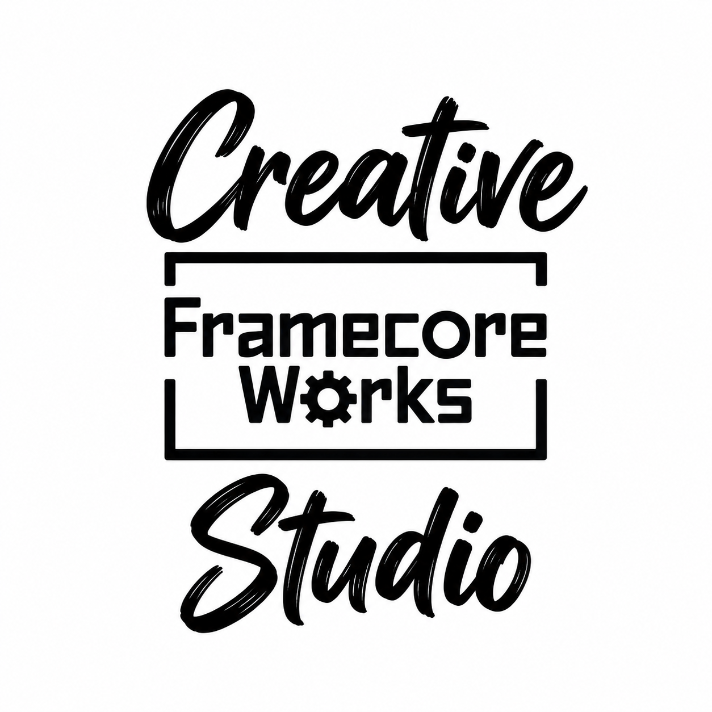

# FrameCore Works Creative Studio



Release: **1.0.0**. [Repository](https://github.com/FrameCoreWorks/framecore-works-creative-studio) · [Installation](INSTALL.md) · [Release status](RELEASE_STATUS.md).

Creative Studio supports creative direction and production planning across image, video, audio and text. Work can begin with a brief, a product photo, a character reference, an existing clip, a script or a concrete correction.

## What it includes

- Quick mode: concise creative directions before detailed production work.
- Deep mode: collaborative development from research and concept through references, storyboard, prompts and editing plans.
- Product and character continuity, realistic reference capture and precise reference sheets.
- Static Graphic Design Creator methods for composition, typography, exact copy and graphic design.
- Music, voice and sound planning in relation to pictures, or picture planning around existing audio.
- Asset records, revisions, scoped preferences and portable handoffs between environments.
- 37 canonical skill entrypoints: 35 specialist routes, the orchestrator and a retained audio compatibility alias.

The package supplies instructions, knowledge, templates and local verification helpers. Generation, media inspection and editing require the user's available tools and authorization. No credentials, paid-provider account, persistent memory service or automatic cross-environment synchronization is bundled.

## Install and use

Read [INSTALL.md](INSTALL.md) for the documented marketplace route and the limits of web/mobile installation. After installation, select **FrameCore Works Creative Studio** and give an ordinary brief. External tools are connected by each user separately.

For updates and maintenance, see [UPDATE.md](UPDATE.md). For the full current module scope, see the [plugin documentation](plugins/framecore-work-creative-studio/README.md).

## Repository layout

| Path | Purpose |
|---|---|
| `.agents/plugins/marketplace.json` | One marketplace entry pointing to the complete plugin |
| `plugins/framecore-work-creative-studio/` | Canonical portable plugin and compatibility manifest |
| `plugins/framecore-work-creative-studio/skills/` | Active skill entrypoints and supporting material |
| `plugins/framecore-work-creative-studio/integrations/` | Pinned source bundles and provenance |
| `plugins/framecore-work-creative-studio/docs/` | Scope, source mapping and verification history |
| `scripts/package_release.py` | Local ZIP packaging and SHA-256 inventories |
| `LICENSE_STATUS.md` | Current licensing boundary and pending owner decision |

## Verify and package

Run from the repository root with Node.js and Python 3 available:

```sh
node plugins/framecore-work-creative-studio/scripts/validate-studio.mjs
python3 scripts/package_release.py
```

The packager runs structural validation first and writes a plugin ZIP, a complete repository ZIP and their SHA-256 inventories into `dist/`. It makes no network requests, installs nothing and does not publish a release. It excludes Git internals and local build outputs.

Current evidence and unverified behavior are recorded in [VERIFICATION.md](VERIFICATION.md). Planned evaluations are not reported as passed tests.

## Licensing

FrameCore Works original code, instructions and documentation are licensed under [Apache-2.0](LICENSE). Both pinned upstream bundles retain Apache-2.0 and their notices. See [licensing scope](LICENSE_STATUS.md) and [NOTICE](NOTICE).
